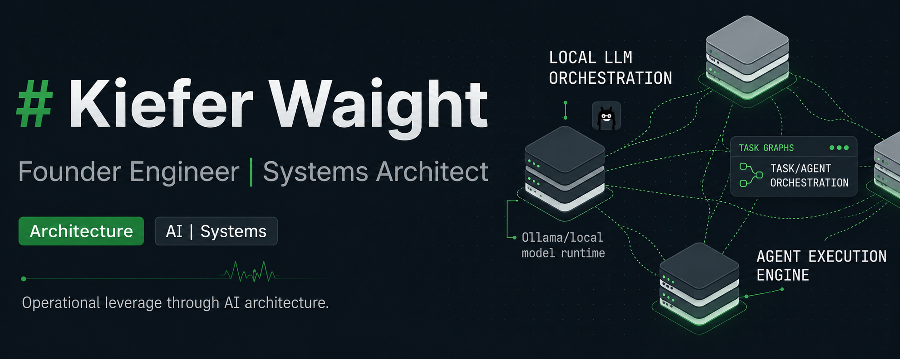

  

# Kiefer Waight
**Founder Engineer | Systems Architect**

  
  
  

> I build technical operating systems that turn early-stage ideas into scalable systems.

---

## 📈 Featured Case Study

### ⚡ [Industrial Telemetry ML System](https://github.com/kieferwaight/industrial-telemetry-ml-system)
> **Applied machine learning system transforming industrial electrical signals into real-time operational intelligence at scale.**
* **The Challenge:** Converting noisy, high-frequency telemetry from commercial compaction hardware into reliable, production-grade signals under harsh, distributed edge conditions.
* **The Architecture:** Engineered a deterministic, local-first inference system with a structured telemetry data matrix—enabling consistent fill-level detection without dependence on fragile cloud pipelines.
* **The Outcome:** Deployed a scalable data acquisition and inference foundation across a nationally distributed footprint, unlocking reliable signal intelligence and enabling progression from prototype to commercial-scale adoption.

👉 **[Read the Full Systems Architecture Breakdown & Implementation →](https://github.com/kieferwaight/industrial-telemetry-ml-system)**

---

### 🧠 Focus
* **Machine Learning & AI Infrastructure:** Designing deterministic runtime environments for local-first intelligence.
* **Agentic Orchestration:** Constructing resilient execution graphs and template-driven routing engines.
* **Bare-Metal Compute Topology:** Architecting highly available local clusters optimized for model evaluation and inference data pipelines.

### 🚀 Current Initiatives
* **LocalFabric** — A localized, high-throughput AI runtime and state-machine engine for workflow orchestration.
* **YAML Runtime** — A template-driven execution framework engineered to de-risk and automate infrastructure scale.
* **Homelab Cluster** — A dedicated 3-node localized compute and ZFS data matrix for private model testing.

### 🏗 Operational Patterns
* **Identify Operational Leverage:** Locate the critical points where AI and automated intelligence compress execution cycles.
* **Build Systems that Unlock Scale:** Avoid bleeding-edge distractions; engineer stable, predictable software environments.
* **Align Execution Through Architecture:** Treat organizational scale as a technical systems routing problem.

---

  <a href="https://kieferwaight.com"><b>Website</b></a> • 
  <a href="https://www.linkedin.com/in/kieferwaight"><b>LinkedIn</b></a>

